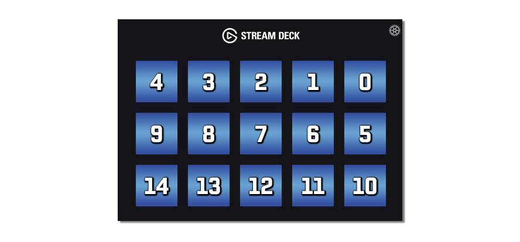

# elgato-stream-deck [](https://npm.im/elgato-stream-deck) [](https://npm.im/elgato-stream-deck) [](https://travis-ci.org/Lange/node-elgato-stream-deck) [](https://coveralls.io/github/Lange/node-elgato-stream-deck?branch=master) [](https://gitter.im/node-elgato-stream-deck/Lobby?utm_source=badge&utm_medium=badge&utm_campaign=pr-badge&utm_content=badge)



[`elgato-stream-deck`](https://github.com/lange/elgato-stream-deck) is a Node.js library for interfacing
with the [Elgato Stream Deck](https://www.elgato.com/en/gaming/stream-deck).

> ❗ Please note that `node-elgato-stream-deck` is NOT a standalone application. It is not something you download and run on its own. It is not an alternative to the [official Stream Deck program provided by Elgato](https://www.elgato.com/en/gaming/downloads). Instead, `node-elgato-stream-deck` is a code library, which developers can use to make their own applications which interface with the Stream Deck.

## Install

`$ npm install --save elgato-stream-deck`

All of this library's native dependencies ship with prebuilt binaries, so having a full compiler toolchain should not be necessary to install `node-elgato-stream-deck`.

However, in the event that installation _does_ fail (**or if you are on a platform that our dependencies don't provide prebuilt binaries for, such as a Raspberry Pi**), you will need to install a compiler toolchain to enable npm to build some of `node-elgato-stream-deck`'s dependencies from source. Expand the details block below for full instructions on how to do so.

<details>
	<summary>Compiling dependencies from source</summary>
	
* Windows
  * Install [`windows-build-tools`](https://github.com/felixrieseberg/windows-build-tools):
  ```bash
  npm install --global windows-build-tools
  ```
* MacOS
  * Install the Xcode Command Line Tools:
  ```bash
  xcode-select --install
  ```
* Linux (**including Raspberry Pi**)
  * Follow the instructions for Linux in the ["Compiling from source"](https://github.com/node-hid/node-hid#compiling-from-source) steps for `node-hid`:
	```bash
	sudo apt-get install build-essential git
	sudo apt-get install gcc-4.8 g++-4.8 && export CXX=g++-4.8
	sudo apt-get install sudo apt install libusb-1.0-0 libusb-1.0-0-dev
	```
  * Install a recent version of Node.js.:
	```bash
	curl -sL https://deb.nodesource.com/setup_8.x | sudo -E bash -
	sudo apt-get install -y nodejs 
	```
  * Try installing `node-elgato-stream-deck`
  * If you still have issues, ensure everything is updated and try again:
	```bash
	sudo apt-get update && sudo apt-get upgrade
	```
</details>

## Table of Contents

* [Example](#example)
* [Features](#features)
* [Planned Features](#planned-features)
* [Contributing](#contributing)
* [API](#api)
  * [`write`](#write)
  * [`fillColor`](#fill-color)
  * [`fillImageFromFile`](#fill-image-from-file)
  * [`fillImage`](#fill-image)
  * [`fillPanel`](#fill-panel)
  * [`clearKey`](#clear-key)
  * [`clearAllKeys`](#clear-all-keys)
  * [`setBrightness`](#set-brightness)
* [Events](#events)
  * [`down`](#down)
  * [`up`](#up)
  * [`error`](#error)
* [Protocol Notes](#protocol-notes)

### Example

#### JavaScript

```javascript
const path = require('path');
const StreamDeck = require('elgato-stream-deck');

// Automatically discovers connected Stream Decks, and attaches to the first one.
// Throws if there are no connected stream decks.
// You also have the option of providing the devicePath yourself as the first argument to the constructor.
// For example: const myStreamDeck = new StreamDeck('\\\\?\\hid#vid_05f3&pid_0405&mi_00#7&56cf813&0&0000#{4d1e55b2-f16f-11cf-88cb-001111000030}')
// Device paths can be obtained via node-hid: https://github.com/node-hid/node-hid
const myStreamDeck = new StreamDeck();

myStreamDeck.on('down', keyIndex => {
	console.log('key %d down', keyIndex);
});

myStreamDeck.on('up', keyIndex => {
	console.log('key %d up', keyIndex);
});

myStreamDeck.on('error', error => {
	console.error(error);
});

// Fill the second button from the left in the first row with an image of the GitHub logo.
// This is asynchronous and returns a promise.
myStreamDeck.fillImageFromFile(3, path.resolve(__dirname, 'github_logo.png')).then(() => {
	console.log('Successfully wrote a GitHub logo to key 3.');
});

// Fill the first button form the left in the first row with a solid red color. This is synchronous.
myStreamDeck.fillColor(4, 255, 0, 0);
console.log('Successfully wrote a red square to key 4.');
```

#### TypeScript

```typescript
import StreamDeck = require('elgato-stream-deck');
const myStreamDeck = new StreamDeck(); // Will throw an error if no Stream Decks are connected.

myStreamDeck.on('down', keyIndex => {
	console.log('key %d down', keyIndex);
});

myStreamDeck.on('up', keyIndex => {
	console.log('key %d up', keyIndex);
});

myStreamDeck.on('error', error => {
	console.error(error);
});
```

### Features

* Multiplatform support: Windows 7-10, MacOS, Linux, and even Raspberry Pi!
* Key `down` and key `up` events
* Fill keys with images or solid RGB colors
* Fill the entire panel with a single image, spread across all keys
* Set the Stream Deck brightness
* TypeScript support

### Planned Features

* [Hotplugging](https://github.com/Lange/node-elgato-stream-deck/issues/14)
* [Key combinations](https://github.com/Lange/node-elgato-stream-deck/issues/9)
* Support "pages" feature from the official Elgato Stream Deck software
* [Text labels](https://github.com/Lange/node-elgato-stream-deck/issues/6)
* [Changing the standby image](https://github.com/Lange/node-elgato-stream-deck/issues/11)

### Contributing

The elgato-stream-deck team enthusiastically welcomes contributions and project participation! There's a bunch of things you can do if you want to contribute! The [Contributor Guide](CONTRIBUTING.md) has all the information you need for everything from reporting bugs to contributing entire new features. Please don't hesitate to jump in if you'd like to, or even ask us questions if something isn't clear.

All participants and maintainers in this project are expected to follow [Code of Conduct](CODE_OF_CONDUCT.md), and just generally be kind to each other.

Please refer to the [Changelog](CHANGELOG.md) for project history details, too.

### API

#### <a name="write"></a> `> streamDeck.write(buffer) -> undefined`

Synchronously writes an arbitrary [`Buffer`](https://nodejs.org/api/buffer.html) instance to the Stream Deck.
Throws if an error is encountered during the write operation.

##### Example

```javascript
// Writes 16 bytes of zero to the Stream Deck.
streamDeck.write(Buffer.alloc(16));
```

#### <a name="fill-color"></a> `> streamDeck.fillColor(keyIndex, r, g, b) -> undefined`

Synchronously sets the given `keyIndex`'s screen to a solid RGB color.

##### Example

```javascript
// Turn key 4 (the top left key) solid red.
streamDeck.fillColor(4, 255, 0, 0);
```

#### <a name="fill-image-from-file"></a> `> streamDeck.fillImageFromFile(keyIndex, filePath) -> Promise`

Asynchronously reads an image from `filePath` and sets the given `keyIndex`'s screen to that image.
Automatically scales the image to 72x72 and strips out the alpha channel.
If necessary, the image will be center-cropped to fit into a square.

##### Example

```javascript
// Fill the second button from the left in the first row with an image of the GitHub logo.
streamDeck.fillImageFromFile(3, path.resolve(__dirname, 'github_logo.png'))
	.then(() => {
		console.log('Successfully wrote a GitHub logo to key 3.');
	})
	.catch(err => {
		console.error(err);
	});
```

#### <a name="fill-image"></a> `> streamDeck.fillImage(keyIndex, buffer) -> undefined`

Synchronously writes a buffer of 72x72 RGB image data to the given `keyIndex`'s screen.
The buffer must be exactly 15552 bytes in length. Any other length will result in an error being thrown.

##### Example

```javascript
// Fill the third button from the left in the first row with an image of the GitHub logo.
const sharp = require('sharp'); // See http://sharp.dimens.io/en/stable/ for full docs on this great library!
sharp(path.resolve(__dirname, 'github_logo.png'))
	.flatten() // Eliminate alpha channel, if any.
	.resize(streamDeck.ICON_SIZE, streamDeck.ICON_SIZE) // Scale up/down to the right size, cropping if necessary.
	.raw() // Give us uncompressed RGB.
	.toBuffer()
	.then(buffer => {
		return streamDeck.fillImage(2, buffer);
	})
	.catch(err => {
		console.error(err);
	});
```

#### <a name="fill-panel"></a> `> streamDeck.fillPanel(imagePathOrBuffer[, sharpOptions]) -> Promise`

Asynchronously applies an image to the entire panel, spreading it over all keys. The image is scaled down and center-cropped to fit. This method does not currently account for the gaps between keys, and behaves as if each key was directly connected to its neighbors. If you wish to account for the gaps between keys, you'll need to do so via other means, and bake that into the image you provide to `fillPanel`.

This method accepts either a path to an image on the disk, or a buffer. The image or path or buffer is passed directly to [`sharp`](https://github.com/lovell/sharp). Therefore, this method accepts all images and buffers which `sharp` can accept.

##### Example

```javascript
// Fill the second button from the left in the first row with an image of the GitHub logo.
streamDeck.fillPanel(path.resolve(__dirname, 'examples/fixtures/sunny_field.png'))
	.then(() => {
		console.log('Successfully filled the panel with an image.');
	})
	.catch(err => {
		console.error(err);
	});
```

#### <a name="clear-key"></a> `> streamDeck.clearKey(keyIndex) -> undefined`

Synchronously clears the given `keyIndex`'s screen.

#### <a name="clear-all-keys"></a> `> streamDeck.clearAllKeys() -> undefined`

Synchronously clears all keys on the device.

##### Example

```javascript
// Clear the third button from the left in the first row.
streamDeck.clearKey(2);
```

#### <a name="set-brightness"></a> `> streamDeck.setBrightness(percentage) -> undefined`

Synchronously set the brightness of the Stream Deck. This affects all keys at once. The brightness of individual keys cannot be controlled.

##### Example

```javascript
// Set the Stream Deck to maximum brightness
streamDeck.setBrightness(100);
```

### Events

#### <a name="down"></a> `> down`

Fired whenever a key is pressed. `keyIndex` is the 0-14 numerical index of that key.

##### Example

```javascript
streamDeck.on('down', keyIndex => {
	console.log('key %d down', keyIndex);
});
```

#### <a name="up"></a> `> up`

Fired whenever a key is released. `keyIndex` is the 0-14 numerical index of that key.

##### Example

```javascript
streamDeck.on('up', keyIndex => {
	console.log('key %d up', keyIndex);
});
```

#### <a name="error"></a> `> error`

Fired whenever an error is detected by the `node-hid` library.
**Always** add a listener for this event! If you don't, errors will be silently dropped.

##### Example

```javascript
streamDeck.on('error', error => {
	console.error(error);
});
```

### Protocol Notes

Raw protocol notes can be found in [NOTES.md](NOTES.md). These detail the protocol and method for interacting with the Stream Deck which this module implements.
